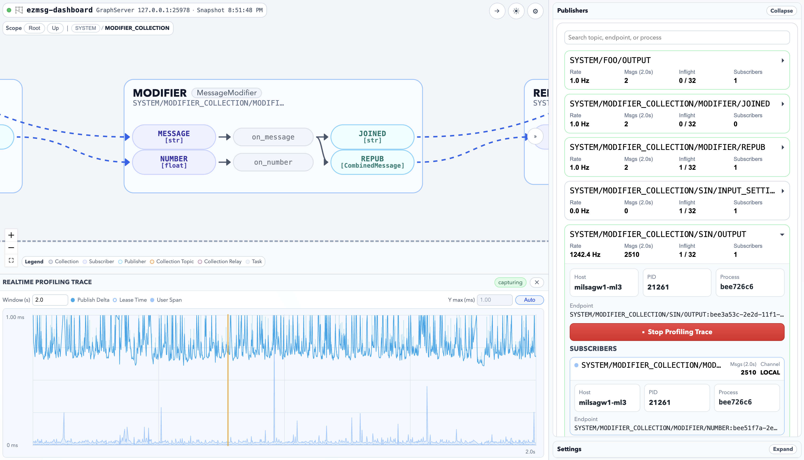

# ezmsg-dashboard



`ezmsg-dashboard` is a web dashboard for inspecting and operating running `ezmsg` systems.

It combines:
- a Python backend that talks to `GraphContext`
- a React/TypeScript frontend for topology, publishers, settings, and trace visualization
- fixture-backed tests for graph layout, inspector behavior, profiling, and visual regression coverage

This package is published as `ezmsg.dashboard` and follows the namespace packaging style used by other `ezmsg` extensions.

The release artifact is intended to be installed as a normal Python package:

```bash
pip install ezmsg ezmsg-dashboard
```

Runtime installs do not require `npm`. The published wheel/sdist includes a prebuilt frontend bundle that the Python backend serves directly.

Documentation lives in [docs/README.md](/Users/milsagw1/repos/ezmsg-dashboard/docs/README.md).

__NOTE:__ This software was written in heavy collaboration (vibe coded) with ChatGPT 5.4.  It appears functional and has been used to evaluate a variety of `ezmsg` deployments, but this in no way implies fitness for any particular use, or that the code is anything more than AI slop.  The human(s) who have their name associated with this package do not fully understand how the code was designed/functions and will not necessarily be helpful in GitHub issues or PRs.  It should be treated as a tool that is nice when it works well and solves a problem, and as an inspirational jumping board/mockup for what `ezmsg-dashboard` could be with a real development push by human developers.

## Features

- Live topology rendering with left-to-right and top-to-bottom layouts
- Scoped collection navigation with breadcrumb and in-graph open/up controls
- Settings inspection and patching
- Publisher and subscriber profiling views
- Profiling trace capture and timing visualization
- Frontend fixture mode for deterministic graph and profiling scenarios
- Unit, Playwright, and screenshot-based regression tests

## Running

### End-user runtime

After installing `ezmsg` and `ezmsg-dashboard`, launch the packaged dashboard server directly:

```bash
ezmsg dashboard --graph-address 127.0.0.1:25978
```

or use the fallback console script:

```bash
ezmsg-dashboard --graph-address 127.0.0.1:25978
```

This starts the Python backend and serves the packaged frontend from the same process.

If you want core `ezmsg` to host the graph server and dashboard together:

```bash
ezmsg serve --dashboard
```

For local setup, development mode, testing, fixture scenarios, and release steps, use the [Development Guide](/Users/milsagw1/repos/ezmsg-dashboard/docs/development.md).

## License

MIT. See [LICENSE.txt](/Users/milsagw1/repos/ezmsg-dashboard/LICENSE.txt).
