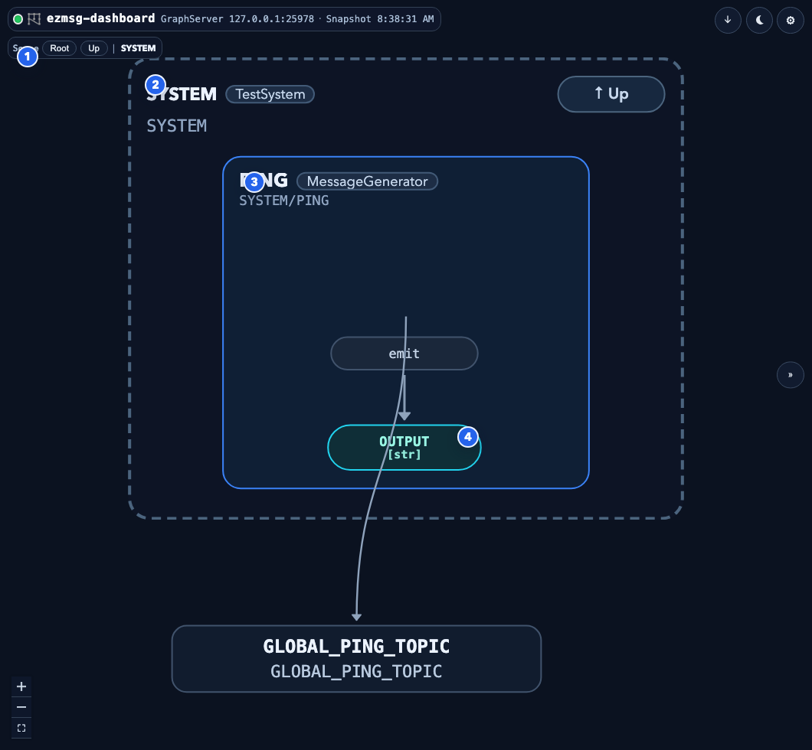
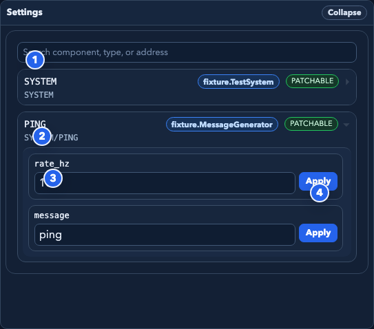
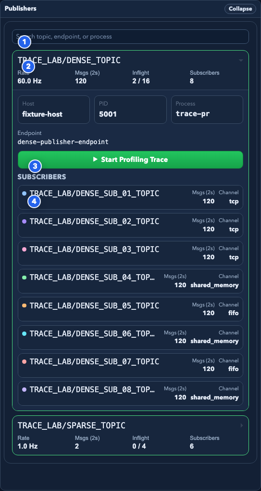
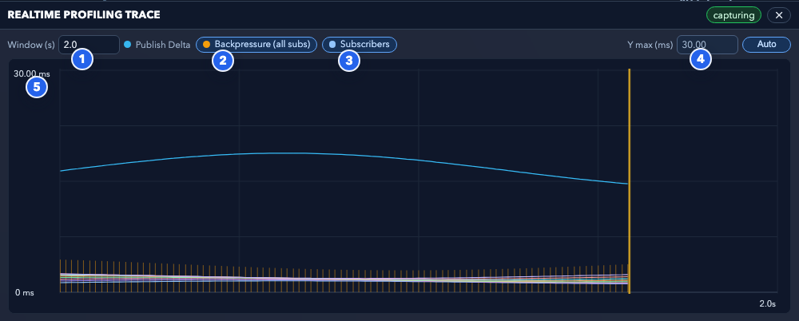

# User Guide

`ezmsg-dashboard` is a live operations view for an `ezmsg` graph. It gives you three main workflows:

- understand structure in the topology view
- inspect and patch settings
- inspect publisher/subscriber health and timing traces

## Main Layout

The dashboard has three major areas:

- **Topology**: the large graph view
- **Publishers**: profiling and subscriber health
- **Settings**: component settings and patch controls

## Topology

1. **Scope controls**: `Root`, breadcrumb chips, and scope context let you move between collection levels.
2. **Active collection frame**: the dashed scope card shows the currently opened collection.
3. **Unit card**: each unit shows its name, type, address, tasks, and streams.
4. **Stream/topic node**: stream endpoints, topics, and relays are rendered as pills connected by edges.

### What To Do Here

- Click a unit to focus it in **Settings**.
- Click a publisher or subscriber stream to focus it in **Publishers** and fit the topology view.
- Use the top-right shortcuts to toggle layout direction and theme.
- Use `Open` on a collection to descend into that scope.
- Use `Up` or breadcrumbs to move back out.

### Reading The Graph

- **Collections** are dashed frames.
- **Units** are solid cards.
- **Inputs** and **outputs** are color-coded pill nodes inside units.
- **Topics** and **relays** appear as standalone pill nodes when they are collection-owned or orphaned.
- The legend in the lower-left of the topology can be toggled on if needed.

## Settings

1. **Search**: filter components by address, name, or type.
2. **Component row**: select the component you want to inspect or edit.
3. **Field editor**: settings fields are rendered with a widget appropriate for their type when possible.
4. **Apply button**: submits a patch for that field only.

### Settings Behavior

- Only components with patchable settings can be edited.
- Patchable components are marked `PATCHABLE`.
- Read-only components are shown but cannot be modified.
- The dashboard patches one field at a time.
- Successful patches show a short applied status inline.
- Failed patches show an inline error.

### Supported Field Styles

- **Boolean**: checkbox
- **Number**: numeric input with bounds when available
- **Choice**: select menu
- **Text**: single-line text input
- **JSON / structured fallback**: text area or serialized value editor

## Publishers

1. **Publisher row**: surfaces always-on snapshot metrics for a publisher topic.
2. **Trace control**: starts or stops profiling trace capture for the selected publisher endpoint.
3. **Subscriber filter**: hides subscribers with zero messages in the current snapshot window.
4. **Subscriber row**: shows the subscriber topic, host, channel kind, and snapshot message count.

### Typical Workflow

1. Search for a topic or endpoint.
2. Expand a publisher row.
3. Inspect its rate, message count, inflight state, and host.
4. Review the subscriber list.
5. Start a profiling trace if the publisher needs timing-oriented investigation.

## Trace Dock

1. **Window**: controls how many seconds of trace history are visible.
2. **Subscriber metric selector**: switches subscriber traces between lease time and user span.
3. **Publish Delta key**: identifies the fixed publisher cadence trace.
4. **Y max**: fixes the Y scale instead of using auto-scaling.
5. **Trace canvas**: plots publish delta, lease time, and user span series over time.

### Trace Workflow

1. Start profiling trace from a publisher row.
2. Wait for the trace dock to populate.
3. Adjust the time window if the graph is too sparse or too dense.
4. Switch the subscriber metric between lease time and user span as needed.
5. Lock `Y max` if the auto scale is making comparisons hard.

## Theme And Layout Controls

The top-right dock in the topology viewport contains:

- **Layout toggle**: left-to-right vs top-to-bottom
- **Theme toggle**: light vs dark
- **Global settings**: snapshot interval, default layout, legend/minimap visibility, trace defaults, inspector width, and auto-fit/auto-focus behaviors

## Good Troubleshooting Patterns

- If the graph is visually dense, switch layout direction.
- If the inspector feels cramped, increase inspector width in global settings.
- If the publisher list is noisy, use search and the idle-subscriber filter.
- If a trace looks flat or over-compressed, adjust `Window (s)` or switch `Y max` from `Auto` to `Fixed`.
- If a component is not editable, check whether it is marked `PATCHABLE` in Settings.

## Current Limits

- Screenshot examples in this guide come from deterministic fixtures, not a live graph.
- The Publishers pane depends on profiling snapshot data. A stream can exist in topology while Publishers remains empty if profiling data is not available for it.
- The dashboard emphasizes readability and navigation over exhaustive raw protocol inspection.
